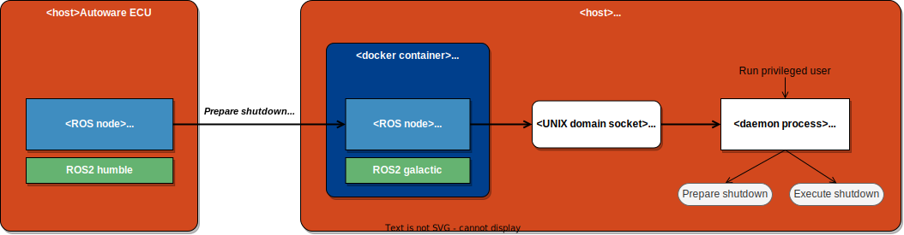

# boot_shutdown_tools

## boot_shutdown_interface_core

A ROS node to prepare and execute shutdown.

---

## boot_shutdown_service

A daemon process to prepare and execute shutdown by receiving messages via UNIX domain socket.
This process communicates with boot_shutdown_guest.



### Installation

This process supports Jetson AGX Xavier™ platform such as [ROScube-X](https://www.adlinktech.com/Products/ROS2_Solution/ROS2_Controller/ROScube-X).

1. Install dependencies

   ```console
   sudo apt install -y libboost-dev libboost-serialization-dev
   ```

1. Pull executable from docker image

   Jetson platform has no build environment, so docker image should be built and executable should be pulled from docker image.

   ```console
   cd boot_shutdown_tools
   docker build . -f docker/Dockerfile -t boot_shutdown
   docker run --name boot_shutdown.service boot_shutdown:latest
   CONTAINER=`docker ps -a | grep boot_shutdown.service | awk '{print $1}'`
   docker cp $CONTAINER:/opt/ros/overlay_ws/build/boot_shutdown_interface/boot_shutdown_service .
   docker rm $CONTAINER
   ```

### How to use

1. Run daemon process as privileged user

   ```console
   sudo ./boot_shutdown_service
   ```

---

## boot_shutdown_guest

A ROS node to receive requests to prepare and execute shutdown from a node to manage boot/shutdown and send requests to boot_shutdown_service.

### How to use

1. Run docker image

   ```console
   docker run --rm -it --net host -v /tmp/boot_shutdown:/tmp/boot_shutdown boot_shutdown:latest ros2 launch boot_shutdown_interface boot_shutdown_guest.launch.xml
   ```

## Testing

Do `ros2 service call` from your host.

1. PrepareShutdown

   ```console
   ros2 service call api/perception/one/prepare_shutdown boot_shutdown_api_msgs/srv/PrepareShutdown
   ```

1. ExecuteShutdown

   ```console
   ros2 service call api/perception/one/execute_shutdown boot_shutdown_api_msgs/srv/ExecuteShutdown
   ```